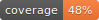

## Destinations API

API to enrich destinations info.




### Stack

* [Django](https://www.djangoproject.com/) as main web Framework
* [Django Rest Framework](http://www.django-rest-framework.org/) as API development tooling
* [Postgres](http://www.django-rest-framework.org/) for SQL Database
* [Redis](http://redis.io/) for caching and memoizations.
* [Docker/docke-compose](http://www.django-rest-framework.org/) for development and standalone deployments.

### Features

- [x] Registration
- [x] Autthentication (JWT Token)
- [x] Accounts (Users/Devices)

## Getting started

### Backend

You need to have installed `git`, `docker`, `ssh` and a decent `terminal`.

1. `make build` build the images for development.
2. `make fixtures` load initial data (optional).
3. `make up` start development server.

Probably you need to user the following command for another situations.

* `make django` to enable `debug` mode during development.
* `make migrations` run django makemigrations command
* `make migrate` run django migrate command
* `make superuser` make a superuserfor develoment

#### Translation

* `make locales` generate translation strings.
* `localhost:8000/rosetta/` complete strings in other languages.
* `make compile_locales` compile translation strings.

### Frontend

There ares some transactional view which uses some frontend technologies like tailwindcss.
You neeed to do the following steps to run it.

1. `make frontend_start`. Starts frontend development server.
2. `make frontend_build` Generates frontend assets for production.

### Tunneling to test webhooks

Tunnel is configure with cloudflare and is required in special in payments testing.
To start using it. a cloudflare account is required, and permissions for `codemia.dev` domain.
Also tunnel configuration files are required.

```
brew install cloudflared
cloudflared tunnel login
make tunnel
```

**Option 2**
localltunnel is another good options for tunneling.

```bash
# Install localtunnel
npm install -g localtunnel
lt --port 8000

# get public IP
curl ipv4.icanhazip.com

# open tunnel
lt -s places -p 8000
```

### Considerations for payments

To start testing payment in development you need sync payments assets.

```
make command ARG=sync_payment_products
make command ARG=sync_payment_prices
```

### Testing

* `make test` run pytest over all test files in the project
* `make test ARG=path_to_file` run pytest of a single test file.

### Code Quality

Firstly we need to configure pre-commit hooks, we need to do this just one time.

* `brew install pre-commit` installs pre-commit
* `pre-commit install` install hooks in the current repo.
* `pre-commit autoupdate` enables the pre-commit autoupdate.

Recurring commands:

* `make coverage` run pytest and generate the coverage report.
* `make lint` run flake8 and generate linting report.
* `make report_coverage` serves the coverage report as html at `localhost:3000`
* `make report_lint` serves the lint report as html at `localhost:3001`

Composed commonly used command:

```
make review
```

### Pre commit actions

* `make isort` Fix posible import issues
* `make lint` Check code quality based on PEP-8 styleguidees
* `make tests` Run the tests with unittest
* `make pytest` Run the tests with pytest

### Simulate Stripe Events

```
stripe trigger payment_intent.canceled
stripe trigger payment_intent.created
stripe trigger payment_intent.payment_failed
stripe trigger payment_intent.processing
stripe trigger payment_intent.succeeded
```

## Tools

- Postman Collection
- Swagger API docs

### SSL Certificates

```bash
sudo apt install certbot python3-certbot-nginx
sudo certbot --nginx -d places.codemia.dev
sudo nginx -t
service nginx restart
```


